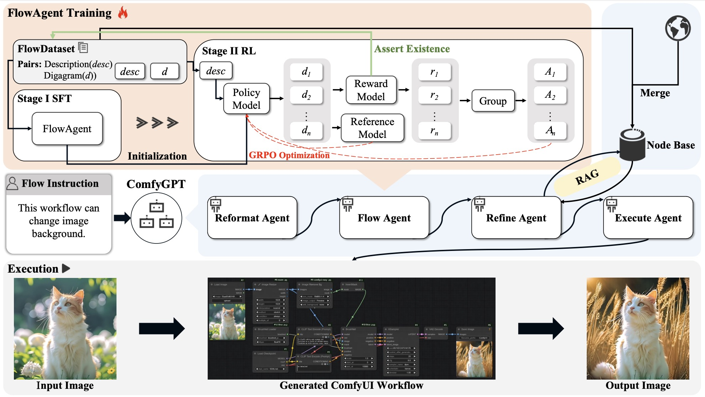

<div align="center">

# ComfyGPT: A Self-Optimizing Multi-Agent System for Comprehensive ComfyUI Workflow Generation
[](https://comfygpt.github.io/)
[](https://arxiv.org/abs/2503.17671)
[](https://huggingface.co/xiatianzs/resources/tree/main)

**Oucheng Huang**<sup>1*</sup>&ensp; **Yuhang Ma**<sup>2*†</sup>&ensp; **Zeng Zhao**<sup>2✉</sup>&ensp; **Mingrui Wu**<sup>1</sup>&ensp;  
**Jiayi Ji**<sup>1</sup>&ensp; **Rongsheng Zhang**<sup>2</sup>&ensp; **Zhipeng Hu**<sup>2</sup>&ensp; **Xiaoshuai Sun**<sup>1✉</sup>&ensp; **Rongrong Ji**<sup>1</sup>

<sup>1</sup> Key Laboratory of Multimedia Trusted Perception and Efficient Computing, Ministry of Education of China, Xiamen University  
<sup>2</sup> Fuxi AI Lab, NetEase Inc.  

<sup>*</sup>Equal Contribution  <sup>†</sup>Project Lead  <sup>✉</sup>Equal Advising

</div>

<p align="center">
  
</p>

## 🚀 Quick Start

### Environment Setup

Follow the steps below to set up the environment:

1. Create a new conda environment and activate it:
   ```bash
   conda create -n comfygpt python==3.10
   conda activate comfygpt

2. Install the required dependencies:
   ```bash
   pip install -r requirements.txt

3. Download Model and Resources from [this link](https://huggingface.co/xiatianzs/resources/tree/main?clone=true) and place it in the `./comfygpt/` directory.

4. Inference
    ```bash
    python infer.py --instruction "This workflow can generate image, using sd3 model."
    ```

## 🏋️ Training
To train our **RefineAgent**, we utilize [LLaMA-Factory](https://github.com/hiyouga/LLaMA-Factory), a powerful framework for fine-tuning large language models. 

The training configuration files, including the JSON and YAML files, can be found in the `train/sft` directory.

## 📚 Citation

If you find Comfygpt useful in your research, please cite our work:

```bibtex
@misc{huang2025comfygptselfoptimizingmultiagentcomprehensive,
      title={ComfyGPT: A Self-Optimizing Multi-Agent System for Comprehensive ComfyUI Workflow Generation}, 
      author={Oucheng Huang and Yuhang Ma and Zeng Zhao and Mingrui Wu and Jiayi Ji and Rongsheng Zhang and Zhipeng Hu and Xiaoshuai Sun and Rongrong Ji},
      year={2025},
      eprint={2503.17671},
      archivePrefix={arXiv},
      primaryClass={cs.MA},
      url={https://arxiv.org/abs/2503.17671}, 
}
```